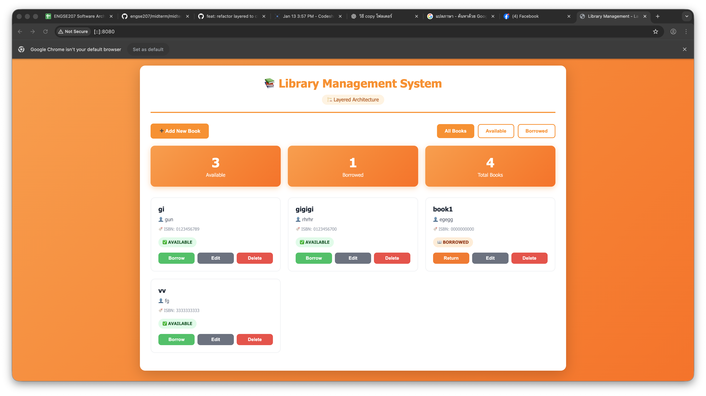
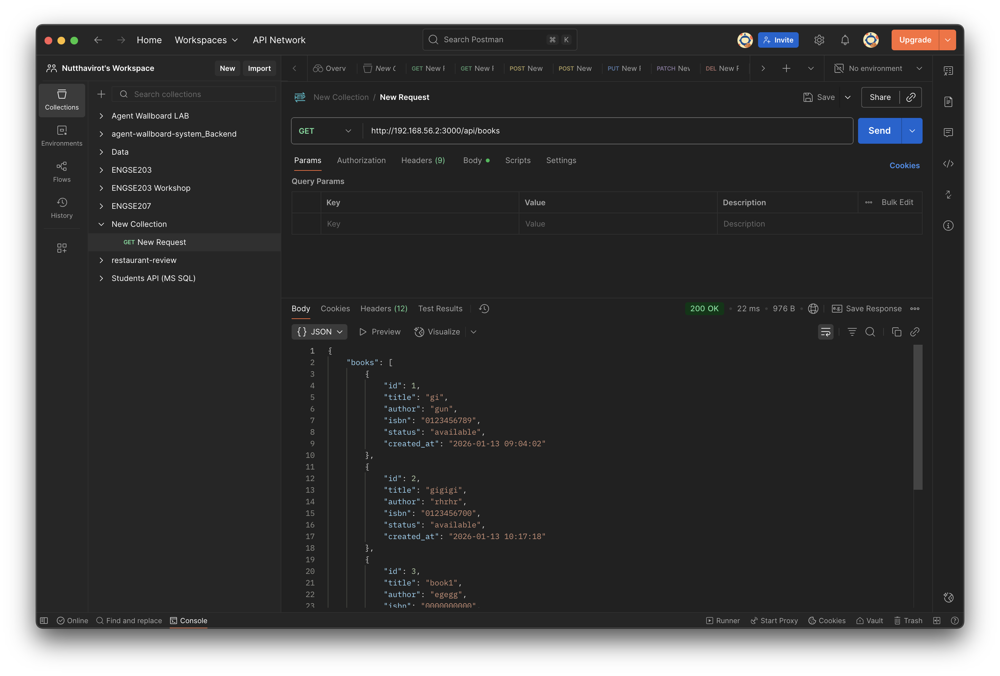
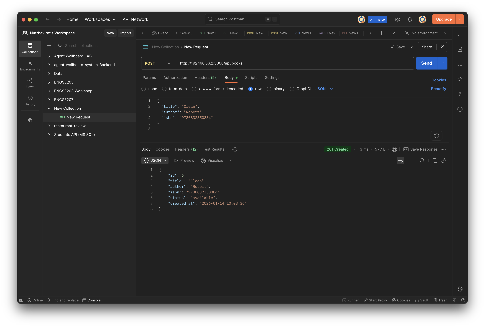
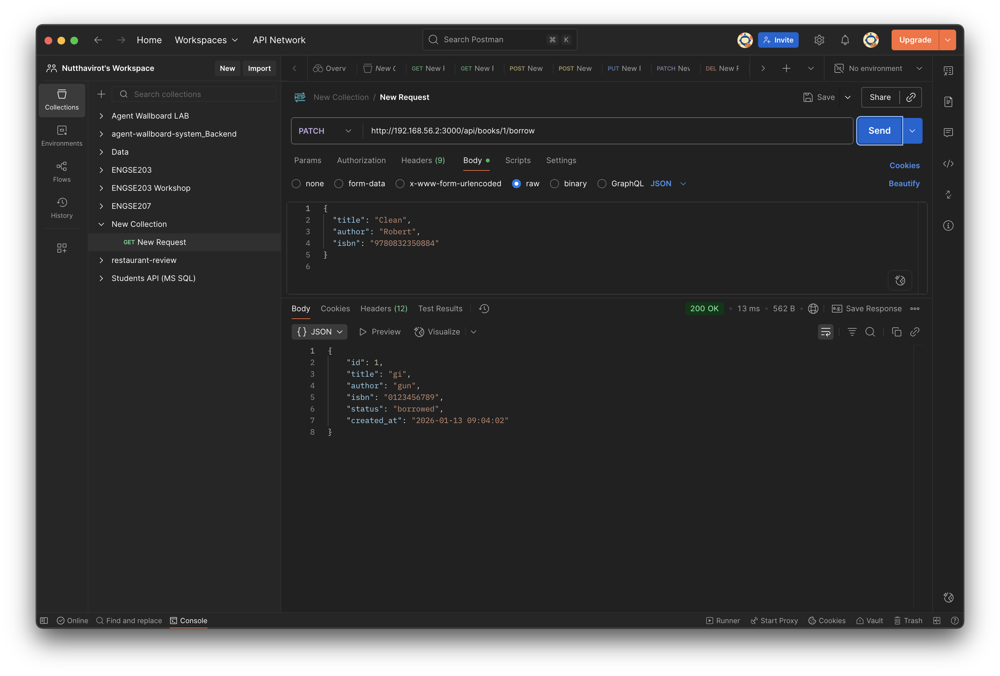
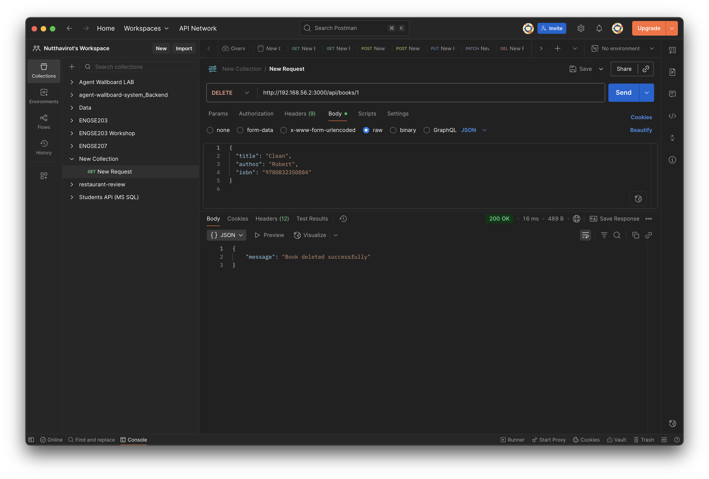

# Library Management System - Client-Server Architecture

## Project Information
- **Student Name:** [นายณัฐวิโรจน์ สุทธิธารมงคล]
- **Student ID:** [67543210026-0]
- **Course:** ENGSE207 - Bonus Exam

## Architecture

### Before: Layered Architecture
- Single application
- Frontend + Backend ผูกติดกัน

### After: Client-Server Architecture
- **Backend:** REST API (Node.js + Express + SQLite)
- **Frontend:** Web Client (HTML + CSS + JavaScript)
- **Communication:** HTTP/JSON

## Project Structure

```
midterm-bonus-<รหัส>/
├── backend/         # Server (VM)
└── frontend/        # Client (Local)
```

## How to Run

### Backend (Server - VM)
```bash
cd backend
npm install
npm start
# Server: http://192.168.56.2:3000
```

### Frontend (Client - Local)
```bash
cd frontend
# Open index.html in browser
# Or use: python3 -m http.server 8080
```

## API Endpoints

## Base URL
```
http://192.168.56.2:3000/api
```

## Endpoints

### 1. Get All Books
```bash
curl http://192.168.56.2:3000/api/books
```

**Expected:**
```json
{
  "books": [...],
  "statistics": {
    "available": 0,
    "borrowed": 0,
    "total": 0
  }
}
```

### 2. Create Book
```bash
curl -X POST http://192.168.56.2:3000/api/books \
  -H "Content-Type: application/json" \
  -d '{
    "title": "Clean Code",
    "author": "Robert C. Martin",
    "isbn": "9780132350884"
  }'
```

### 3. Borrow Book
```bash
curl -X PATCH http://192.168.56.2:3000/api/books/1/borrow
```

### 4. Return Book
```bash
curl -X PATCH http://192.168.56.2:3000/api/books/1/return
```

### 5. Delete Book
```bash
curl -X DELETE http://192.168.56.2:3000/api/books/1
```

## Screenshots












